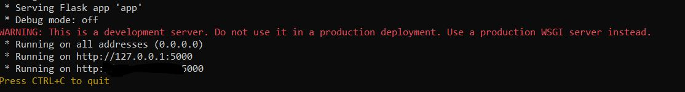
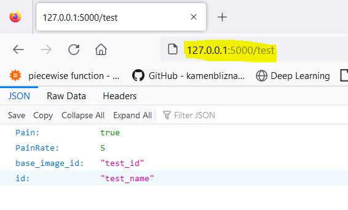
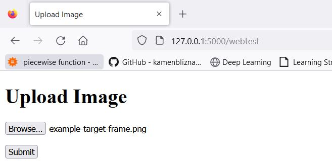
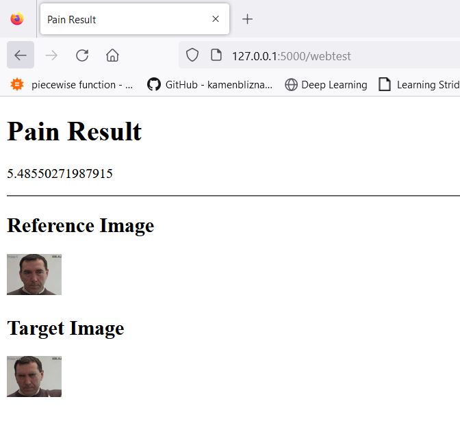
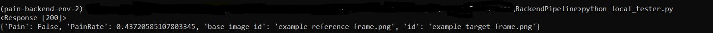
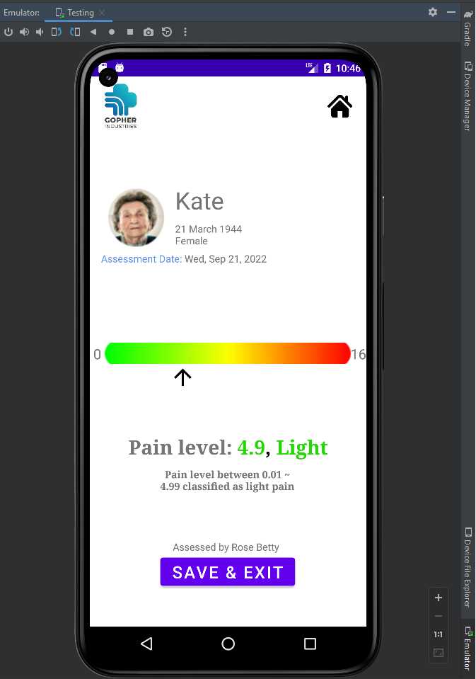

<p align="center">
  <a href="" rel="noopener">
 </a>
</p>

<h3 align="center">PainRate - Monitoring pain or discomfort in non
verbal patients</h3>

<div align="center">

[]()
[](https://github.com/Gopher-Industries/Team-Justice-League/issues)
[](https://github.com/Gopher-Industries/Team-Justice-League/pulls)
</div>

---

<p align="center"> PainRate application is intended to be used by healthcare professionals and caregivers inside healthcare and aged care settings to monitor for any patient discomfort, empowering carers to deliver better care and pain management solutions for vulnerable populations (non verbal patients).
    <br> 
</p>

## 📝 Table of Contents

- [About](#about)
- [Getting Started](#getting_started)
- [Deployment](#deployment)
- [Android Usage](#usage)
- [Built Using](#built_using)
- [TODO](../TODO.md)
- [Authors](#authors)
- [Acknowledgments](#acknowledgement)

## 🧐 About <a name = "about"></a>

When a patient is unable to self-report their pain, there is a much greater chance that they will be given the incorrect diagnosis. This can result in the use of inappropriate, ineffective, or insufficient treatment and management tactics, all of which can lead to poor patient outcomes ranging from discomfort to greater risk of infection, circulatory disorders, compromised immune system, or even death. To resolve this issue, our product will provide health care professionals with a mobile application which can perform reliable and accurate patient pain assessments using machine learning and computer vision.

The key deliverables of this product are:
• A simple, user-friendly application which can utilise the built-in camera on a smart phone to record the face/body language of a patient.
• This visual data will be passed to a cloud-based assessment engine which can analyse the data using a computer vision model to evaluate a patient’s level of discomfort.
• If the output of the model is higher than a specific threshold the application will send an alert to the carer/medical practitioner.
• A dashboard inside the application will provide an overview to visually track recent assessments and the patient’s condition over time.

## 🏁 Getting Started <a name = "getting_started"></a>

These instructions will get you a copy of the project up and running on your local machine for development and testing purposes. See [deployment](#deployment) for notes on how to deploy the project on a live system.

```
git clone https://github.com/Gopher-Industries/Team-Justice-League
```
### Prerequisites

The project requires Android studio for application to run.

For backend service, follow steps in the next section to get started.


### Installing

A step by step series of examples that tell you how to get a development env running.
The backend module contains the service for predicting Pain intensity, hosted on GCP (can run on any FLASK server).

For pipeline (T3-2022) with all the models, face recognition and face quality block:
```
cd Team-Justice-League/Server/PainSource/BackendPipeline
conda create -n <env-name> python=3.8
conda activate <env-name>
pip install -r requirements.txt
python app.py
```

For pipeline (T2-2022) with model from https://github.com/TaatiTeam/pain_detection_demo wrapped in a FLASK application:

```
cd Team-Justice-League/Server/PainSource/PainAssessmentSource/
conda create -n <env-name> python=3.8
conda activate <env-name>
pip install -r requirements.txt
python app.py
```
The server will exit once you exit your instance shell/Server, to run in background use <nohup> or simply do:

```
python app.py &
```
On a successful startup, you should see following screen:

<p></p>

## 🔧 Running the tests <a name = "tests"></a>

To test your server copy your GCP instance public IP or if running on local server then:

```
http://127.0.0.1:5000/test
```
You should recieve a test JSON respose from the server:

<p></p>

### Running webtest

To test end to end pipeline (T3-2022), there is a simple webapp


```
http://127.0.0.1:5000/webtest
```

Upload a test image

<p></p>

If the test image passess the quality block, then face recognition fetches the base image (if present) and calculates the pain rating

<p></p>

[To test T2-2022 pipeline] 
Navigate to:

```
http://127.0.0.1:5000/
```
### Local test

Web app is a simple UI to test end to end flow, for all other testing purposes, local_tester.py should be used.

<p></p>

## 🚀 Deployment <a name = "deployment"></a>

For a step by step deployment and android walkthrough, please go through the User Manual section in the handover document.
The handover document of T2-2022 and T3-2022 has relevant information about the feature research as well as the steps to login to your GCP account and using Android studio.

## Android Usage <a name="usage"></a>

If Android application is successfully set up and REST call is executed then this result page pops up

<p></p>

## ⛏️ Built Using <a name = "built_using"></a>

- [OpenCV](https://opencv.org/) - Framework for Image I/O
- [PyTorch](https://pytorch.org/) - Framework for DL algorithms
- [Scikit-Learn](https://scikit-learn.org/) - Framework for ML algorithms
- [FLASK](https://flask.palletsprojects.com/en/2.2.x/) - Server Framework 
- [Anaconda](https://www.anaconda.com/) - Python Environment
- [Kotlin](https://kotlinlang.org/) - Application development

## ✍️ Authors <a name = "authors"></a>

- [@prateek_singh](https://github.com/PS662) - System design, backend development, pain assessment model development and integration.
- [@nadav_fedida](https://github.com/nadavfedida) - Research and Development of Image Quality block.
- [@karl_birti]()- Face Recognition model development.
- [@kirsten](https://github.com/kclegaspi) - UI/UX and App Dev.

See also the list of [contributors](https://github.com/Gopher-Industries/Team-Justice-League/graphs/contributors) who participated in this project.

## 🎉 Acknowledgements <a name = "acknowledgement"></a>

- Pain assessment source

https://github.com/TaatiTeam/pain_detection_demo

https://github.com/xiaojngxu/ExtendedMTL4Pain

- References

[1]	S. Rezaei, A. Moturu, S. Zhao, K. M. Prkachin, T. Hadjistavropoulos, and B. Taati, “Unobtrusive pain monitoring in older adults with dementia using pairwise and contrastive training,” IEEE J. Biomed. Health Inform., vol. 25, no. 5, pp. 1450–1462, 2021.

[2] Xu, X., Huang, J. S., & De Sa, V. R. (2020). pain evaluation in video using extended multitask learning from multidimensional measurements. In A. V. Dalca, M. B. A. McDermott, E. Alsentzer, S. G. Finlayson, M. Oberst, F. Falck, & B. Beaulieu-Jones (Eds.), Proceedings of the Machine Learning for Health NeurIPS Workshop (Vol. 116, pp. 141–154). PMLR.